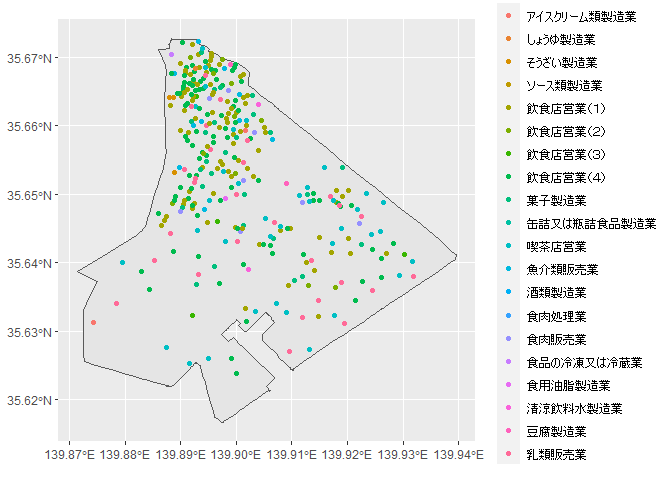
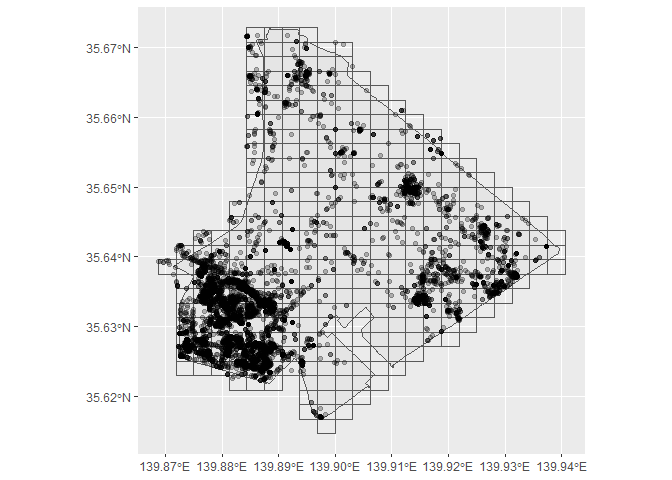

# 2023-08 Urayasu Summer Volunteer

## 収集データについて

- 注意：本リポジトリはデータ収集に使用したコードのみを含みデータは含みません

<details>
<summary>使用パッケージ・共通データ</summary>

``` r
library(tidyverse)
library(sf)

adminbdry_2023 <- read_sf("data/行政区域_2023.geojson")
```

</details>

### 01_食品営業許可施設一覧_2022

- 令和3年5月31日までに取得した営業許可にて営業中の施設

  - 出典：[千葉県食品営業許可施設一覧](https://www.pref.chiba.lg.jp/eishi/kyokaitiran/syokuhineigyoukyoka.html)

- Geocodingにより所在地情報から位置情報に変換

  - [CSISシンプルジオコーディング実験](https://geocode.csis.u-tokyo.ac.jp/)を利用（[利用規約](https://geocode.csis.u-tokyo.ac.jp/home/simple-geocoding/simple-geocoding-tems-of-use/)）

<details>
<summary>食品営業許可施設一覧_2022</summary>

``` r
licensed_food_business_2022 <- read_sf("data/食品営業許可施設一覧_2022.geojson")

licensed_food_business_2022 |> 
  ggplot() +
  geom_sf(data = adminbdry_2023) +
  geom_sf(aes(color = `業種`)) +
  scale_color_discrete(NULL)
```

</details>



### 02_Flickrデータ

- Flickr
  APIを利用してジオタグつき写真のデータを取得しました（[利用規約](https://www.flickr.com/help/terms/apihttps://www.flickr.com/help/terms/api)）

  - Flickr APIを使用するためにはAPI Keyの取得が必要です

- 浦安市内で撮られた写真データを250 mメッシュごとに最大250枚分取得

  - データには画像のリンクを含みますが画像データ自体は含みません

  - これまでに写真の投稿されていないメッシュも存在するようです

<details>
<summary>Flickrデータ</summary>

``` r
photo_search_flickr <- read_sf("data/Flickrデータ.geojson")
grid250m_adminbdry_2023 <- read_sf("data/250mメッシュ_行政区域_2023.geojson")

photo_search_flickr |> 
  ggplot() +
  geom_sf(data = adminbdry_2023) +
  geom_sf(data = grid250m_adminbdry_2023,
          fill = "transparent") +
  geom_sf(alpha = 0.25)
```

</details>


